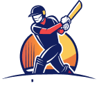

  

# BPL Dream ll

Unleash your cricketing dreams with BPL Dream 11, your ultimate destination for everything cricket! Dive into an exciting world where you can create your dream team, featuring the best cricket players from around the globe. From legendary batsmen like Virat Kohli and Steve Smith to formidable all-rounders like Ben Stokes and Shakib Al Hasan, BPL Dream 11 brings you closer to your cricket heroes.
 
Curate your own squad, strategize, and compete with fellow cricket enthusiasts to see who truly knows the game best. Each player profile is packed with real-time stats, detailed information, and vibrant images to bring the excitement of the pitch right to your screen.
 
Start building your dream team today and join the BPL Dream 11 community where passion meets strategy, and every cricket fan finds their place in the game. 🏏🌟

## Tech Used Building this Master Piece

-   React Library with Vite
-   React Hooks
    -   useStates
-   React SVG
-   React Toastify
-   Tailwind Library
-   DaisyUi Components
-   ES6
    -   map()

## Key Features

-   Claim Coins just by Clicking "Claim Free Credit" Button.
-   Find Your Best player by exploring the Available player section.
-   Any Choosed player will be saved in the "Selected" Section.
-   Forgot how many player you have choosed, just take a glance at "Selected" Button.
-   Want to Replace a player, just Click RedBin icon to deselect that player.
-   Stay Connected with Subsciption for News and Updates.

## Take a glance into the Project

-   Live Link : <https://web10-1348-bpl-dream-ll.netlify.app/>
